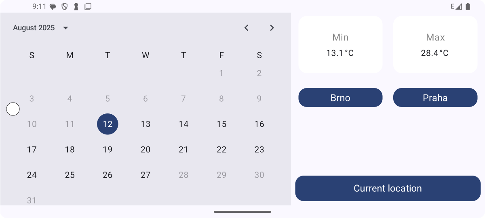
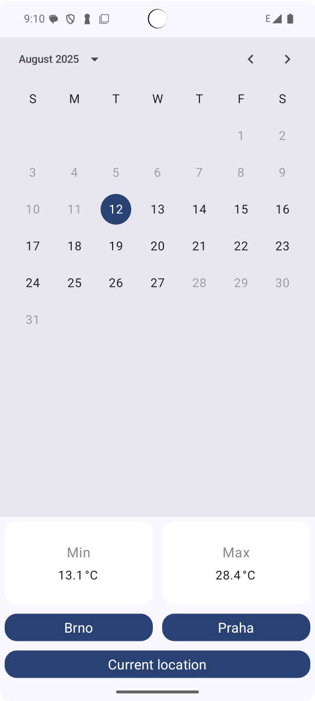

# Android Interview - Česká televize - Weather

A weather application developed as part of an Android interview process for Česká televize. The app allows users to check weather conditions based on a selected date, a chosen city, or their current GPS location.

## Features

*   **Weather by Date:** Users can select a specific date to view historical or forecasted weather information.
*   **Weather by City:** Users can choose from a predefined list of cities (e.g., Praha, Brno) to get current and forecasted weather for that location.
*   **Weather by Current Location:** The app can utilize the device's GPS to fetch and display weather information for the user's current location.
*   **Landscape Orientation Support:** The application interface is designed to adapt to both portrait and landscape screen orientations for an optimal user experience.
*   **Animations** Temperature text animations.

## Screenshots (Optional)

